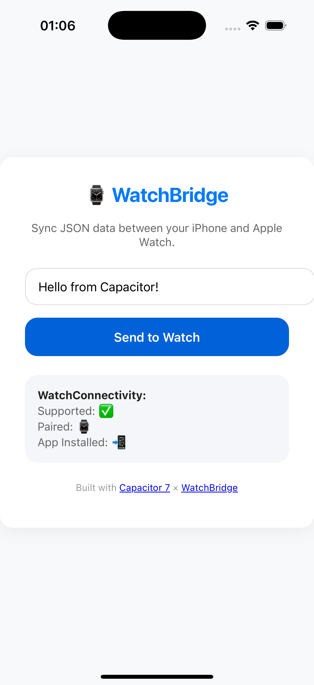

# 📱 Example App – Capacitor Watch Bridge

This is a minimal demo app built with **Capacitor 7** and **Vite** to showcase  
the functionality of the [`capacitor-watch-bridge`](../README.md) plugin.

It demonstrates how to sync JSON data from an iPhone Capacitor app  
to a native **watchOS** app via **WatchConnectivity** and a shared **App Group**.

---

### ⚙️ Setup

1. Make sure you’ve built and linked the plugin:

    ```bash
    npm install
    npx cap sync ios
    ```

2. Open the example app in Xcode:

    ```bash
    npx cap open ios
    ```

3. Make sure the App Group is enabled for both the iOS app and the WatchKit Extension:

    > 💡 The included WatchKit Extension and iOS App already share the same App Group ID: ***group.de.kisimedia.watchbridge***

---

### 🧠 What it shows
- iOS → watchOS JSON sync via updateApplicationContext()
- Shared App Group storage (UserDefaults(suiteName:))
- Live status of the watch connectivity inside the web UI
- A small modern HTML + JS interface styled like a native app

---

### 🕹️ Run in the browser
You can also run the web demo (without native watch features):

```bash
npm start
```

Then open:
👉 http://localhost:5173


---

### 🧩 UI Preview
<p align="center">   </p>

---

### 🛠️ Stack
- Capacitor 7
- Vite
- Swift 5.9
- WatchConnectivity

---

### 🧑‍💻 Author
Built with ❤️ by Kisimedia
for testing and development of the capacitor-watch-bridge plugin.